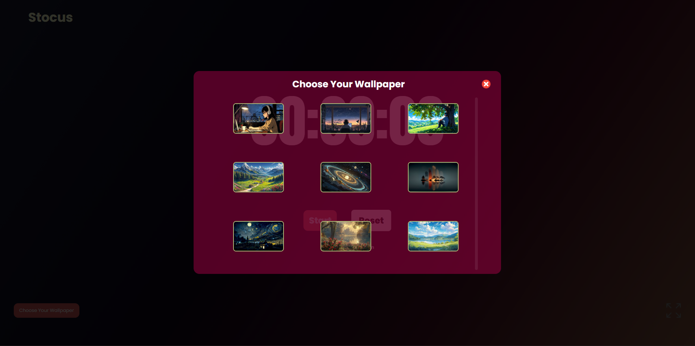

# ⏱️ Stocus  
### An Aesthetic & Customizable Stopwatch

**Stocus** is a modern, minimal, and visually pleasing stopwatch designed to help you stay focused.  
It combines **simplicity**, **aesthetic design**, and **useful customizations** to create a smooth and distraction-free timing experience.

Whether you’re studying, working, or practicing deep focus, **Stocus** adapts to your environment.

---

## ✨ Preview

> A glimpse of Stocus in action — clean UI, immersive backgrounds, and a distraction-free black screen mode.

---

## 🚀 Features

### 🖤 Black Screen Toggle  
Switch instantly to a **pure black screen** for maximum focus and zero distractions.  
Perfect for deep work sessions.

### 🎨 Aesthetic Design  
A carefully crafted UI with smooth gradients, balanced spacing, and a calming visual experience.

### 🖼️ Choose Wallpaper  
Personalize your workspace by selecting from a collection of beautiful wallpapers to match your mood.

### 🖥️ Full Screen Mode  
Go immersive with **fullscreen support**, turning Stocus into a minimal, distraction-free timer.

---

## 🛠️ Built With

- **HTML5** – Structure  
- **CSS3** – Styling & aesthetics  
- **JavaScript (Vanilla)** – Logic & interactivity  

No frameworks. No bloat. Just clean and efficient code.

---

## 🎯 Use Cases

- Study sessions & Pomodoro technique  
- Deep work & focus mode  
- Minimal desk or second-screen stopwatch  
- Aesthetic productivity setups  

---

## 🧠 Future Improvements

- ⏲️ Lap & split timing  
- 💾 Save preferences with localStorage  
- 🌗 Light / Dark theme toggle  
- 🔔 Alarm or session completion sound  

---

## 🤝 Contributing

Contributions are welcome!  
Feel free to fork the repository, open issues, or submit pull requests.

---

## 📜 License

This project is open-source and available under the **MIT License**.

---

## ⭐ Final Note

**Stocus** isn’t just a stopwatch —  
it’s a **focus companion** designed to look good and feel calm while keeping time.

If you like the project, don’t forget to ⭐ the repository!
